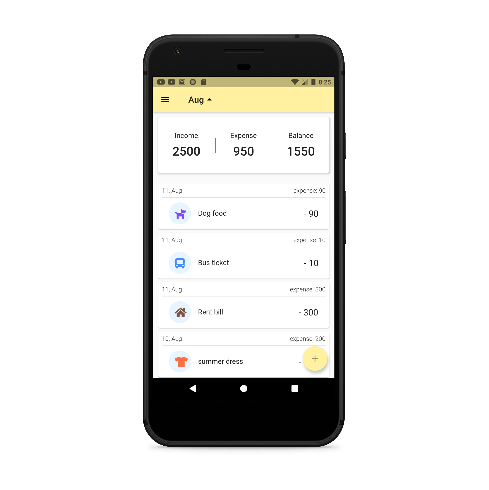

# Money Manager: Expenses Tracker App
Welcome to the Money Manager: Expenses Tracker App project! This app serves as a tool to help users track their expenses, manage their budgets, and gain insights into their spending habits. Built with Dart and Flutter, this application provides a user-friendly interface for efficiently managing financial transactions.

## Features
1. **Expense Tracking:** Allows users to record their expenses, categorize them, and add relevant details such as date, time, and notes.

2. **Budget Management:** Enables users to set budgets for different expense categories and track their spending against these budgets.

3. **Financial Insights:** Provides visualizations and reports to analyze spending patterns, view expense trends over time, and identify areas for potential savings.

4. **Data Security:** Ensures the security of financial data by implementing encryption and authentication mechanisms to protect user information.

5. **Multi-Platform Support:** Built using Flutter, the app can be deployed on both iOS and Android platforms, providing a consistent user experience across devices.

## Installation
To run the Money Manager: Expenses Tracker App locally, follow these steps:

1. **Clone the Repository:** Clone the repository to your local machine using the following command:

git clone https://github.com/RadinaAvramova/Money-Manager-Expenses-tracker-app.git

2. **Navigate to the Directory:** Change your current directory to the location of the cloned repository:

cd Money-Manager-Expenses-tracker-app

3. **Install Dependencies:** Ensure that you have Flutter installed on your machine. Then, install the required dependencies by running:

flutter pub get

4. **Start the Application:** Connect a device or emulator, and run the following command to start the application:

flutter run

5. **Access the Application:** Once the application is running, you can access it directly on your device or emulator to start managing your expenses.

## Usage
1. **Record Expenses:** Add new expenses by entering details such as amount, category, date, and any additional notes.

2. **Set Budgets:** Define budgets for different expense categories to control spending and track budget utilization.

3. **View Reports:** Analyze spending patterns and view visualizations such as charts and graphs to gain insights into your financial habits.

4. **Track Progress:** Monitor your progress towards budget goals and identify areas where adjustments may be needed to meet financial targets.

5. **Secure Your Data:** Take advantage of built-in security features to protect sensitive financial information and ensure privacy.

## Customization
You can customize the Money Manager: Expenses Tracker App by modifying aspects such as the user interface design, expense categories, budget thresholds, and reporting features. Additionally, you can add new features, integrate with external APIs for additional functionality, or optimize performance for scalability.

<strong>App Screenshots: </strong>

<strong>&nbsp;</strong>

<strong>What I used: </strong>

<ul>
<li>Flutter</li>
<li>Moor database</li>
<li>Provider for state management</li>
<li>MVVM architecture + get_it</li>
<li>flutter_local_notifications package</li>
</ul>

<strong>&nbsp;</strong>

